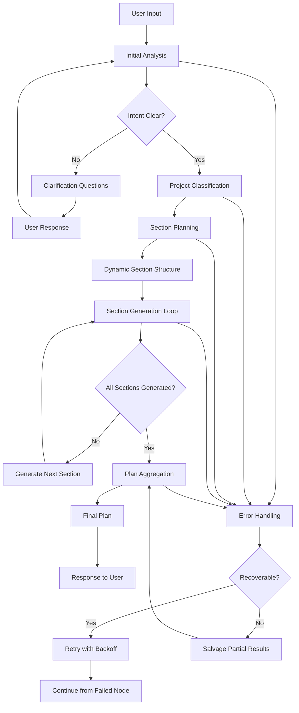

# Mini Traycer AI - Planning Layer Documentation

## 🎯 Overview

Mini Traycer AI is a sophisticated planning assistant that sits **above coding agents** to help them think in structured steps. It's a simplified version of the full Traycer AI system, designed to demonstrate intelligent project planning capabilities through a dynamic, multi-stage pipeline.

### Core Purpose
- **Intelligent Analysis**: Determines if user requests need clarification or can proceed directly
- **Dynamic Planning**: Generates project-specific sections based on actual requirements
- **Context Preservation**: Maintains conversation history and project context throughout the process
- **Adaptive Generation**: Creates implementation-ready documentation with appropriate detail levels

## 🏗️ Tech Stack

### Frontend
- **Next.js 15.5.4** - React framework with App Router
- **React 19.1.0** - UI library with latest features
- **TypeScript 5** - Type-safe development
- **Tailwind CSS 4** - Utility-first styling
- **Shadcn/UI** - Component library with Radix UI primitives

### State Management
- **Redux Toolkit 2.9.0** - Global state management
- **TanStack Query 5.90.2** - Server state and caching

### AI & Planning
- **LangChain 0.4.9** - LLM orchestration framework
- **LangGraph** - State machine for complex workflows
- **Groq API** - High-performance LLM inference
- **Redis 5.8.3** - Caching and rate limiting

### Development Tools
- **ESLint 9** - Code linting
- **PostCSS** - CSS processing
- **Socket.io 4.8.1** - Real-time communication

## 📁 Repository Structure

```
MiniTraycer/
├── client/                          # Next.js frontend application
│   ├── app/                        # App Router structure
│   │   ├── api/generate-plan/      # API endpoint for plan generation
│   │   ├── globals.css            # Global styles
│   │   ├── layout.tsx             # Root layout with providers
│   │   └── page.tsx               # Main chat interface
│   ├── components/                 # React components
│   │   ├── AIMessage.tsx         # AI response display
│   │   ├── ChatHistory.tsx       # Message history container
│   │   ├── ChatInput.tsx          # Input with validation
│   │   ├── ChatPanel.tsx          # Main chat interface
│   │   ├── Markdown.tsx           # Markdown rendering
│   │   └── UserMessage.tsx        # User message display
│   ├── config/                    # Configuration files
│   │   ├── axios.ts              # HTTP client setup
│   │   └── store.ts              # Redux store configuration
│   ├── hooks/                     # Custom React hooks
│   │   └── useGeneratePlan.ts    # Plan generation hook
│   ├── lib/                       # Core business logic
│   │   ├── api/                   # API layer
│   │   ├── constants/             # Application constants
│   │   ├── pipeline/             # Planning pipeline core
│   │   ├── security/              # Security utilities
│   │   ├── utils/                 # Utility functions
│   │   └── validators/            # Input validation
│   ├── provider/                  # React context providers
│   ├── redux/                     # Redux slices
│   └── types/                     # TypeScript definitions
└── README.md                      # This documentation
```

## 🧠 Planning Layer Architecture

### Core Components

#### 1. **Pipeline State Management**
The planning system uses a sophisticated state machine built on LangGraph:

```typescript
interface PipelineState {
  // Input & Context
  userPrompt: string;
  history: ChatMessage[];
  contextSummary: string | null;
  estimatedTokens: number;
  
  // Analysis Results
  needsClarification: boolean;
  clarificationQuestions: string[];
  intentConfidence?: number;
  
  // Project Classification
  projectCategory?: string;
  detectedTechStack: string[];
  suggestedTechStack: string[];
  projectComplexity: "simple" | "moderate" | "complex";
  
  // Planning & Generation
  sections?: Section[];
  generatedSections: Set<string>;
  planSections: PlanSection[];
  finalPlan: string | null;
  
  // System State
  modelUsed: string;
  totalTokensUsed: number;
  retryCount: number;
  stepCount: number;
}
```

#### 2. **Pipeline Nodes**
The system consists of 6 core nodes that process requests sequentially:

1. **`initialAnalysisNode`** - Analyzes user intent and determines if clarification is needed
2. **`clarificationNode`** - Generates targeted questions for unclear requests
3. **`sectionPlanningNode`** - Creates dynamic section structure based on project type
4. **`sectionGeneratorNode`** - Generates detailed content for each section
5. **`planAggregatorNode`** - Combines sections into final polished plan
6. **`retryHandlerNode`** - Handles errors with exponential backoff

#### 3. **Routing Logic**
Intelligent routing determines the next step based on current state:

```typescript
// Example routing logic
export const afterInitialAnalysis = (state: PipelineState): string => {
  if (state.lastError) return "retryHandlerNode";
  if (state.needsClarification) return "clarificationNode";
  return "sectionPlanningNode";
};
```

## 🔄 Planning Flow Diagram



## 🚀 How the Planning Layer Works

### 1. **User Input Processing**
- **Input Validation**: Comprehensive validation using Zod schemas
- **Sanitization**: XSS protection and content security policy checks
- **Rate Limiting**: IP-based rate limiting to prevent abuse
- **Context Building**: Extracts relevant information from conversation history

### 2. **Initial Analysis Phase**
The system analyzes user intent through multiple reasoning passes:

```typescript
// Analysis criteria
const isIntentClear = (
  confidence: number,
  hasDetails: boolean,
  missingInfo: string[],
  canProceedWithDefaults: boolean
): boolean => {
  if (confidence >= 0.7) return true;
  if (confidence >= 0.5 && canProceedWithDefaults) return true;
  if (hasDetails && missingInfo.length === 0) return true;
  return false;
};
```

**Analysis Steps:**
1. **Intent Detection**: Determines what the user wants to build
2. **Detail Assessment**: Evaluates if sufficient information is provided
3. **Confidence Scoring**: Assigns confidence level (0.0-1.0)
4. **Missing Info Identification**: Identifies specific gaps in requirements
5. **Default Capability**: Determines if reasonable defaults can be applied

### 3. **Clarification Flow**
When intent is unclear, the system generates targeted questions:

```typescript
// Example clarification generation
const clarificationPrompt = injectVariables(PROMPTS.CLARIFICATION, {
  prompt: state.userPrompt,
  historyContext,
  missingInfo: state.clarificationQuestions.join(", ")
});
```

**Clarification Features:**
- **Targeted Questions**: Specific, actionable questions (not generic)
- **Open-ended Format**: Avoids yes/no questions
- **Context-aware**: Considers conversation history
- **Priority-based**: Focuses on most critical information gaps

### 4. **Dynamic Section Planning**
The system creates project-specific sections rather than using templates:

```typescript
// Section planning logic
const planningPrompt = injectVariables(PROMPTS.SECTION_PLANNING, {
  prompt: state.userPrompt,
  category: state.projectCategory,
  technologies: technologies,
  complexity: state.projectComplexity
});
```

**Planning Features:**
- **Dynamic Structure**: Generates 5-12 sections based on project needs
- **Priority Scoring**: Each section has priority (1-10)
- **Intent Mapping**: Each section has clear purpose and intent
- **Technology Integration**: Considers detected and suggested tech stacks

### 5. **Adaptive Section Generation**
Sections are generated with adaptive token limits and context awareness:

```typescript
const calculateAdaptiveMaxTokens = (
  sectionTitle: string,
  inputContext: string,
  complexity: string
): number => {
  const baseTokens = estimateTokens(inputContext);
  const complexityFactors = {
    simple: 1.5,
    moderate: 2.5,
    complex: 4.0
  };
  return Math.floor(baseTokens * complexityFactors[complexity]);
};
```

**Generation Features:**
- **Context Preservation**: Previous sections inform current generation
- **Adaptive Length**: Token limits adjust based on complexity
- **Implementation-ready**: Detailed, actionable content (800-2000 words)
- **Consistency**: Maintains terminology and formatting across sections

### 6. **Intelligent Routing**
The system uses sophisticated routing logic to handle different scenarios:

```typescript
export const afterSectionGenerator = (state: PipelineState): string => {
  if (state.lastError) {
    const isRecoverable = state.lastError.includes("timeout") || 
                         state.lastError.includes("rate limit");
    if (isRecoverable && state.retryCount < state.maxRetries) {
      return "retryHandlerNode";
    }
    if (state.planSections.length > 0) {
      return "planAggregatorNode"; // Salvage partial results
    }
  }
  
  if (state.generatedSections.size >= state.sections.length) {
    return "planAggregatorNode";
  }
  
  return "sectionGeneratorNode"; // Continue generation
};
```

### 7. **Error Handling & Recovery**
Comprehensive error handling with multiple recovery strategies:

- **Exponential Backoff**: Retry delays increase with each attempt
- **Partial Recovery**: Salvages completed sections when possible
- **Fallback Generation**: Creates basic plans when aggregation fails
- **Error Classification**: Distinguishes between recoverable and fatal errors

## 🔧 Key Files and Responsibilities

### Core Pipeline Files
- **`lib/pipeline/index.ts`** - Main pipeline orchestration and workflow definition
- **`lib/pipeline/nodes.ts`** - Individual node implementations
- **`lib/pipeline/routing.ts`** - Conditional routing logic
- **`lib/pipeline/state.ts`** - State management and annotations

### Utility Systems
- **`lib/utils/prompts.ts`** - Centralized prompt templates
- **`lib/utils/logger.ts`** - Comprehensive logging system
- **`lib/utils/modelManager.ts`** - LLM model and API key management
- **`lib/utils/llmInvoker.ts`** - LLM invocation with fallback handling

### API Layer
- **`app/api/generate-plan/route.ts`** - Main API endpoint with security
- **`lib/api/generatePlan.ts`** - Client-side API wrapper
- **`lib/validators/apiValidator.ts`** - Request validation and sanitization

### Frontend Components
- **`components/ChatPanel.tsx`** - Main chat interface
- **`components/ChatInput.tsx`** - Input handling with validation
- **`components/ChatHistory.tsx`** - Message display and scrolling
- **`hooks/useGeneratePlan.ts`** - React Query integration

## 🛡️ Security & Performance

### Security Features
- **Input Sanitization**: XSS protection and content filtering
- **Rate Limiting**: IP-based request limiting
- **CSP Validation**: Content Security Policy enforcement
- **Request Size Limits**: Prevents large payload attacks

### Performance Optimizations
- **Token Management**: Adaptive token limits based on complexity
- **Model Fallbacks**: Multiple API keys with intelligent routing
- **Caching**: Redis-based caching for model configurations
- **Streaming Support**: Real-time progress updates (future enhancement)

## 🚀 Getting Started

### Prerequisites
- Node.js 18+ 
- Redis server
- Groq API keys

### Installation
```bash
cd client
npm install
```

### Environment Setup
```bash
# Required environment variables
GROQ_API_KEY=your_groq_api_key
GROQ_API_KEY_2=backup_key_1
GROQ_API_KEY_3=backup_key_2
# ... additional backup keys

REDIS_URL=redis://localhost:6379
```

### Development
```bash
npm run dev
```

## 🔮 Future Improvements

### Planned Enhancements
1. **Streaming Responses**: Real-time progress updates during generation
2. **Multi-language Support**: Internationalization for global users
3. **Template System**: Pre-built templates for common project types
4. **Collaboration Features**: Multi-user planning sessions
5. **Integration APIs**: Connect with external development tools

### Technical Improvements
1. **Advanced Caching**: Intelligent caching of similar requests
2. **Model Optimization**: Fine-tuned models for specific domains
3. **Performance Monitoring**: Detailed analytics and optimization
4. **Error Recovery**: More sophisticated error handling strategies

## 🤝 Contributing

### Development Guidelines
1. **Type Safety**: Maintain strict TypeScript usage
2. **Testing**: Add tests for new pipeline nodes
3. **Documentation**: Update this README for significant changes
4. **Performance**: Monitor token usage and response times

### Key Areas for Contribution
- **New Node Types**: Additional processing capabilities
- **Prompt Engineering**: Improved prompt templates
- **Error Handling**: Enhanced recovery strategies
- **UI/UX**: Better user experience features

## 📊 System Metrics

### Performance Benchmarks
- **Average Response Time**: 15-30 seconds for complex plans
- **Token Efficiency**: 80-90% of estimated tokens used
- **Success Rate**: 95%+ for well-formed requests
- **Clarification Rate**: 20-30% of requests need clarification

### Monitoring
The system includes comprehensive logging for:
- **Pipeline Execution**: Step-by-step progress tracking
- **Token Usage**: Detailed token consumption metrics
- **Error Rates**: Failure analysis and recovery success
- **Performance**: Response times and throughput

---

**Mini Traycer AI** represents a sophisticated approach to intelligent project planning, combining modern web technologies with advanced AI orchestration to create a powerful planning assistant that can adapt to any project type and complexity level.